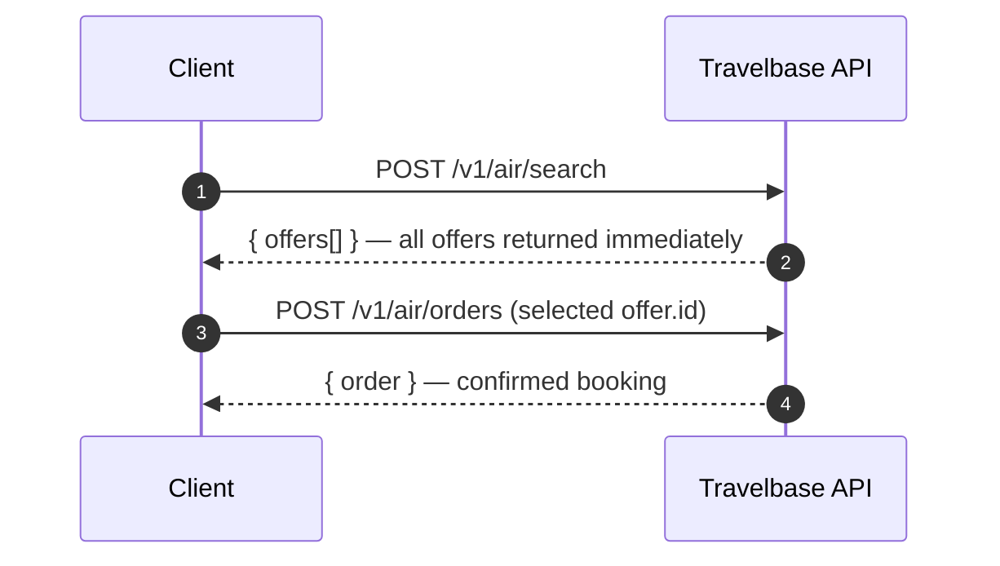

<Info>
    Flight search in Travelbase is **synchronous**. A single `POST /v1/air/search` request returns all available offers immediately.
</Info>

## How it works

Travelbase uses a **single‑request model**: one call returns all live offers inline. Each offer in the response carries its own `id` — pass that directly to `POST /v1/air/orders` to confirm a booking.



<CardGroup cols={2}>
    <Card title="Synchronous by design" icon="bolt-lightning">
        One request, one response. Offers are returned inline — no polling loop, no separate offer‑fetch step required.
    </Card>
    <Card title="offer.id is your booking key" icon="key">
        Every offer returned carries a unique `id`. Pass it directly to the orders endpoint — no intermediate lookup needed.
    </Card>
    <Card title="Offer expiry still applies" icon="clock">
        Each offer has an `expires_at`. Always check it before initiating a booking — expired offers cannot be booked.
    </Card>
    <Card title="Re‑search to refresh" icon="rotate-right">
        If a user returns after an offer expires, run a new search. Never re‑present stale, cached offers.
    </Card>
</CardGroup>

## Quickstart

<Steps>
    <Step title="Search for flights">

        Send a `POST` request with your origin, destination, date, and passenger details. The API responds immediately with a full list of bookable offers.

        ```bash
        POST /v1/air/search
        Content-Type: application/json
        Authorization: Bearer <token>
        ```

        ```json
        {
            "slices": [
        {
            "origin": "LOS",
            "destination": "LHR",
            "departure_date": "2025-09-14"
        }
            ],
            "passengers": [
        { "type": "adult" }
            ],
            "cabin_class": "economy"
        }
        ```

        **Response**

        ```json
        {
            "data": {
            "slices": [...],
            "passengers": [...],
            "offers": [
        {
            "id": "off_0000AEdFkLPQNPPHhwYUJk",
            "total_amount": "432.50",
            "total_currency": "USD",
            "expires_at": "2025-09-14T14:28:00Z",
            "owner": {
            "iata_code": "BA",
            "name": "British Airways"
        },
            "slices": [...],
            "passenger_identity_documents_required": false
        }
            ]
        }
        }
        ```

        <Tip>
            The `offer.id` returned in each offer object is your booking key. Store the ID of the offer your user selects — you’ll pass it directly to the orders endpoint.
        </Tip>

    </Step>

    <Step title="Select an offer and book">

        Once the user picks an offer, pass its `id` to `POST /v1/air/orders` with passenger details and payment. No intermediate lookup is required.

        ```bash
        POST /v1/air/orders
        Content-Type: application/json
        Authorization: Bearer <token>
        ```

        ```json
        {
            "selected_offers": ["off_0000AEdFkLPQNPPHhwYUJk"],
            "passengers": [
        {
            "id": "pas_0001",
            "born_on": "1990-04-22",
            "email": "ada@example.com",
            "family_name": "Lovelace",
            "given_name": "Ada",
            "gender": "f",
            "phone_number": "+44 7700 900077",
            "title": "ms"
        }
            ],
            "payments": [
        {
            "type": "balance",
            "currency": "USD",
            "amount": "432.50"
        }
            ]
        }
        ```

        A `201 Created` response confirms the booking. The response body contains your `order.id`, booking reference, and full itinerary.

        <Warning>
            Always compare `offer.expires_at` to the current time before initiating payment. Booking an expired offer returns `422 offer_no_longer_available`.
        </Warning>

    </Step>
</Steps>

## Request reference

### `POST /v1/air/search`

| Field | Type | Required | Description |
|-------|------|----------|-------------|
| `slices` | array | ✓ | One or more route segments. Each requires `origin`, `destination`, and `departure_date`. |
| `passengers` | array | ✓ | At least one passenger with a `type` of `adult`, `child`, or `infant_without_seat`. |
| `cabin_class` | string | — | Preferred cabin: `economy`, `premium_economy`, `business`, or `first`. Defaults to `economy`. |
| `max_connections` | integer | — | Maximum connections per slice. Set to `0` for direct flights only. |

#### Slice object

| Field | Type | Required | Description |
|-------|------|----------|-------------|
| `origin` | string | ✓ | IATA airport or city code for the departure point (e.g. `LOS`, `LHR`). |
| `destination` | string | ✓ | IATA airport or city code for the arrival point. |
| `departure_date` | string | ✓ | ISO 8601 date (`YYYY-MM-DD`). Covers all departures on this date. |

## Offer object

Every item in `data.offers[]` is a complete, bookable itinerary priced in real time.

| Property | Description |
|----------|-------------|
| `id` | **Your booking key.** Pass this as `selected_offers[0]` when creating an order. |
| `total_amount` | Total price for all passengers as a decimal string. |
| `total_currency` | ISO 4217 currency code (e.g. `USD`, `NGN`, `GBP`). Always display alongside `total_amount`. |
| `expires_at` | ISO 8601 datetime after which this offer can no longer be booked. |
| `owner` | Airline responsible for fulfilling the itinerary (`iata_code`, `name`). |
| `slices` | Array of slice objects — segments, stops, cabin, baggage allowance. |
| `passenger_identity_documents_required` | Whether passport/ID numbers are required at the time of booking. |

## Best practices

<CardGroup cols={3}>
    <Card title="Debounce search input" icon="hand">
        Avoid firing on every keystroke. Trigger search on form submission or after **400–600 ms** of inactivity.
    </Card>
    <Card title="Respect offer expiry" icon="timer">
        Check `offer.expires_at` before showing the booking CTA. Prompt a re‑search if expiry is imminent.
    </Card>
    <Card title="Never cache stale offers" icon="database">
        Don’t persist offers across sessions or page reloads. Run a fresh search each time the user begins a booking flow.
    </Card>
    <Card title="Sort client‑side" icon="arrow-up-wide-short">
        Offers are returned unordered. Sort by `total_amount`, duration, or stops in your UI — no extra API call needed.
    </Card>
    <Card title="Display currency correctly" icon="money-bill">
        Always render `total_currency` alongside `total_amount`. Offers from different airlines may be in different currencies.
    </Card>
    <Card title="Handle 422 gracefully" icon="circle-exclamation">
        If booking returns `offer_no_longer_available`, redirect the user to a fresh search rather than surfacing a raw error.
    </Card>
</CardGroup>

## Common mistakes

<AccordionGroup>
    <Accordion title="Looking for an offer_request_id in the response" icon="triangle-exclamation">
        Travelbase’s search endpoint is synchronous. There is no `offer_request_id` to store or poll with. Offers are returned directly in `data.offers[]` on the initial response.

        **Fix:** Read offers from `response.data.offers`. Use each `offer.id` to proceed to booking.
    </Accordion>

    <Accordion title="Polling for offers after the search response" icon="triangle-exclamation">
        There is no asynchronous pipeline. You do not need to call `GET /v1/air/offers` separately. All offers are included synchronously in the search response body.

        **Fix:** Remove any polling logic. A single `POST /v1/air/search` is the complete search flow.
    </Accordion>

    <Accordion title="Presenting expired offers for booking" icon="triangle-exclamation">
        Attempting to create an order with an expired offer returns `422 offer_no_longer_available`, creating a dead‑end mid‑checkout.

        **Fix:** Compare `offer.expires_at` to `Date.now()` before showing the booking confirmation step. If expired, redirect to a new search.
    </Accordion>

    <Accordion title="Re‑running a search on every render" icon="triangle-exclamation">
        Firing a new search on every component mount or route change wastes rate‑limit quota and introduces avoidable latency.

        **Fix:** Cache the search result in component or session state. Only re‑search when the user explicitly changes their query.
    </Accordion>

    <Accordion title="Ignoring total_currency" icon="triangle-exclamation">
        Displaying a price without its currency code is a compliance risk. Offers from different sources may return different currencies.

        **Fix:** Always render `total_currency` with `total_amount`. Format using `Intl.NumberFormat` with the user’s locale and the appropriate currency code.
    </Accordion>
</AccordionGroup>

## Error reference

| HTTP Status | Code                         | Meaning |
|-------------|------------------------------|---------|
| `400`       | `invalid_search_params`      | Malformed request — check required fields, date formats, and IATA codes. |
| `401`       | `unauthorized`               | Missing or invalid `Authorization` header. |
| `422`       | `offer_no_longer_available`  | The selected offer expired or sold out. Prompt the user to re‑search. |
| `429`       | `rate_limit_exceeded`        | Too many requests — implement exponential backoff starting at 500 ms. |
| `500`       | `internal_server_error`      | Upstream airline source error. Retry once, then contact support with the `x-request-id` header value. |

## API reference

<CardGroup cols={2}>
    <Card title="POST /v1/air/search" icon="magnifying-glass" href="/api-reference/air/create-search">
        Search for available flights. Returns a complete `offers[]` array synchronously.
    </Card>
    <Card title="GET /v1/air/offers/:id" icon="circle-info" href="/api-reference/air/get-offer">
        Fetch full fare conditions, baggage rules, and seat availability for a single offer.
    </Card>
    <Card title="POST /v1/air/orders" icon="bag-shopping" href="/api-reference/air/create-order">
        Convert an offer into a confirmed booking using the `offer.id` from search.
    </Card>
    <Card title="Manage Orders" icon="clipboard-list" href="/guides/manage-orders">
        Handle post‑booking actions — cancellations, changes, and seat selection.
    </Card>
</CardGroup>

## Next steps

<CardGroup cols={3}>
    <Card title="Book an offer" icon="ticket" href="/guides/create-order">
        Convert an offer into a confirmed booking with passenger details and payment.
    </Card>
    <Card title="Manage orders" icon="clipboard-list" href="/guides/manage-orders">
        Handle post‑booking flows — cancellations, amendments, and ancillary services.
    </Card>
    <Card title="Webhooks" icon="bell" href="/guides/webhooks">
        Subscribe to real‑time events for order status, schedule changes, and more.
    </Card>
</CardGroup>