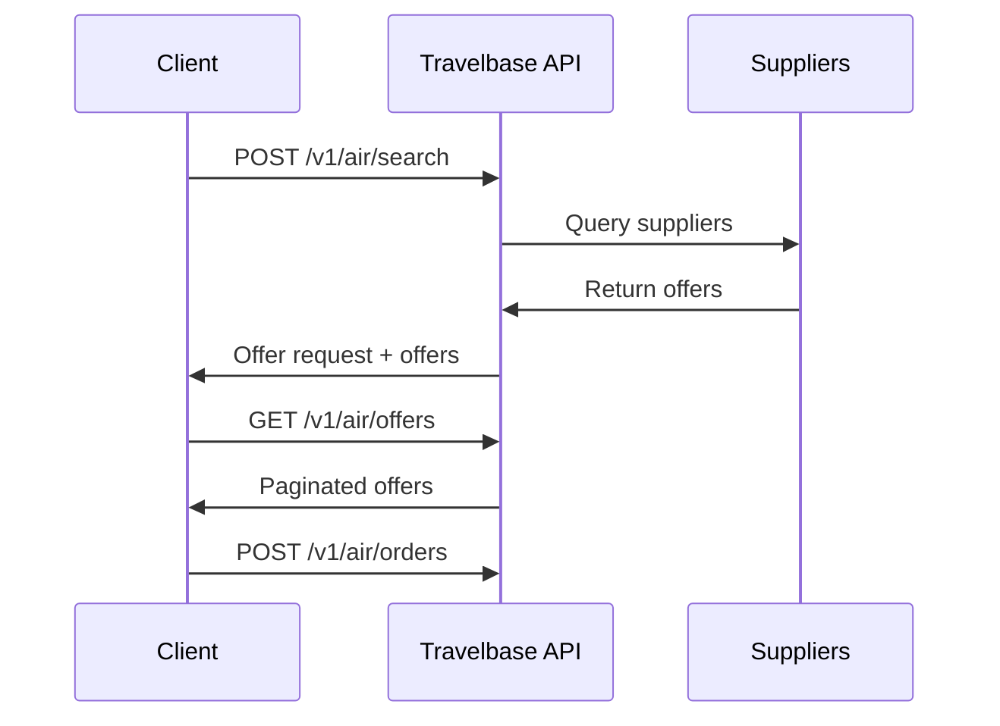
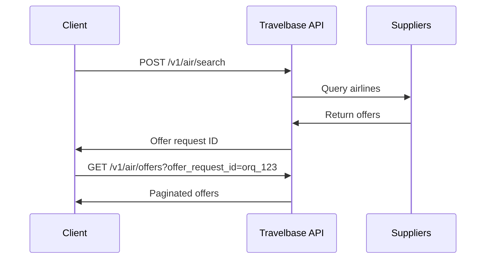

The Offers API allows you to search for flights and retrieve priced itineraries from airline and supplier systems.

Offers represent **priced flight options** that can be booked by creating an order.

---

## Overview

Offer retrieval is a two-step process:

1. Create an offer request
2. Retrieve offers associated with that request

This design ensures:

- Deterministic search results
- Supplier timeout isolation
- Async supplier aggregation support
- Pagination support
- Reliable pricing consistency

---

## Offer Lifecycle



# Create Offer Request

```http
POST /v1/air/search
Creates an offer request and optionally returns available offers.
This endpoint initiates a supplier search across airline systems.
```

# Request Body

```json
{
"data": {
"slices": [
{
"origin": "JFK",
"destination": "LAX",
"departure_date": "2026-03-22"
}
],
"passengers": [
{
"type": "adult"
}
],
"cabin_class": "economy"
},
"return_offers": true,
"supplier_timeout": 20
}
```

### Request Fields

| Field | Type | Required | Description |
|---|---|---|---|
| data | object | Yes | Offer request parameters |
| data.slices | array | Yes | Flight segments |
| data.passengers | array | Yes | Passenger list |
| data.cabin_class | string | Yes | Cabin class |
| return_offers | boolean | No | Return offers immediately |
| supplier_timeout | integer | No | Supplier timeout in seconds |

---

### Slice Object

Defines a flight segment.

```json
{
  "origin": "JFK",
  "destination": "LAX",
  "departure_date": "2026-03-22"
}
```

### Passenger Object
```josn {
"type": "adult"
}
```
#### Supported passenger types:
- adult
- child
- infant

## Cabin Classes
Supported values:
- economy
- premium_economy
- business
- first

# Example Request
```curl
https://sandbox.travelbase.ai/v1/air/search \
-H "x-api-key: YOUR_API_KEY" \
-H "Content-Type: application/json" \
-d '{
"data": {
"slices": [
{
"origin": "JFK",
"destination": "LAX",
"departure_date": "2026-03-22"
}
],
"passengers": [
{
"type": "adult"
}
],
"cabin_class": "economy"
},
"return_offers": true
}'
```
# Response
```json
{
"id": "orq_01HXYZ123",
"object": "offer_request",
"created_at": "2026-02-23T18:25:43Z",
"offers": [
{
"id": "off_01HXYZ456",
"object": "offer",
"total_amount": "230.00",
"currency": "USD",
"expires_at": "2026-02-23T19:25:43Z"
}
]
}
```

---

## GET /v1/air/offers

Returns a paginated list of offers associated with a specific offer request.

This endpoint allows you to retrieve offers after creating an offer request using `/v1/air/search`.

<Card title="Prerequisite: Create an Offer Request" icon="search" href="/tenant-api/offers#post-v1-air-search">
    You must create an offer request before retrieving offers.
</Card>

---

## How It Works


### Query Parameters

Use the following query parameters to filter and paginate offers returned from an offer request.

| Parameter | Type | Required | Description |
|---|---|---|---|
| `offer_request_id` | string | Yes | Unique identifier of the offer request. This value is returned from the `/v1/air/search` endpoint. |
| `limit` | integer | No | Maximum number of offers to return in a single response. Useful for pagination and performance optimization. |
| `after` | string | No | Cursor used to retrieve the next page of results. Pass the cursor value returned from a previous response. |
| `before` | string | No | Cursor used to retrieve the previous page of results. |
| `sort` | string | No | Sort order of offers. Supported values may include price, duration, departure_time, or arrival_time depending on availability. |
| `max_connections` | integer | No | Maximum number of allowed flight connections. Use `0` for direct flights only, `1` for one connection, etc. |

---

### Example Usage

```bash
curl "https://sandbox.travelbase.ai/v1/air/offers?offer_request_id=orq_123&limit=10&max_connections=0" \
  -H "x-api-key: YOUR_API_KEY"
```

# Example Request

## Retrieve Flight Offers

Use this endpoint to fetch a list of available flight offers based on a specific `offer_request_id`.

<Tabs>
    <Tab title="cURL">
        ```bash
        curl
        [https://sandbox.travelbase.ai/v1/air/offers?offer_request_id=orq_123](https://sandbox.travelbase.ai/v1/air/offers?offer_request_id=orq_123)
        \
        -H "x-api-key: YOUR_API_KEY"
        ```
    </Tab>

    <Tab title="JavaScript">
        ```javascript
        const response = await fetch(
        "[https://sandbox.travelbase.ai/v1/air/offers?offer_request_id=orq_123](https://sandbox.travelbase.ai/v1/air/offers?offer_request_id=orq_123)",
        {
            headers: {
            "x-api-key": "YOUR_API_KEY"
        }
        }
        );

        const data = await response.json();
        console.log(data);
        ```
    </Tab>

    <Tab title="Python">
        ```python
        import requests

        url = "[https://sandbox.travelbase.ai/v1/air/offers](https://sandbox.travelbase.ai/v1/air/offers)"
        params = {
        "offer_request_id": "orq_123",
    }
        headers = {
        "x-api-key": "tb_live_xxxxxxxxx"
    }

        response = requests.get(url, params=params, headers=headers)
        print(response.json())
        ```
    </Tab>
</Tabs>

### Request Details

| Parameter | Type | Required | Description |
| :--- | :--- | :--- | :--- |
| `offer_request_id` | `string` | Yes | The unique identifier returned from the search request. |
| `x-api-key` | `header` | Yes | Your Travelbase authentication key. |

---

# Response
Returns a paginated list of offers.
```json
{
  "object": "list",
  "data": [
    {
      "id": "off_123",
      "object": "offer",
      "total_amount": "210.00",
      "currency": "USD",
      "expires_at": "2026-02-23T19:25:43Z"
    }
  ],
  "has_more": false
}
```

---

## Response Fields

The response returns a paginated list of offer objects.

| Field | Type | Description |
|---|---|---|
| `object` | string | Always returns `list`. |
| `data` | array | Array of offer objects. |
| `has_more` | boolean | Indicates whether additional offers are available. |

---

## Offer Object (Summary)

Each item in the `data` array represents a flight offer.

| Field | Type | Description |
|---|---|---|
| `id` | string | Unique identifier of the offer. |
| `object` | string | Object type. Always `offer`. |
| `total_amount` | string | Total price of the offer. |
| `currency` | string | ISO 4217 currency code. |
| `expires_at` | string | Timestamp indicating when the offer expires. |

<Card
    title="Retrieve Full Offer Details"
    icon="arrow-right"
    href="/tenant-api/offers#get-v1-air-offers-id"
>
    Use the offer ID to retrieve complete itinerary, segments, and available services.
</Card>

---

## Pagination

This endpoint supports cursor-based pagination for efficient retrieval of large result sets.

Use the `limit`, `after`, and `before` parameters to navigate between pages.

### Example

```bash
GET /v1/air/offers?offer_request_id=orq_123&limit=10&after=cursor
```

# Filtering Connections
```text
You can restrict the maximum number of flight connections returned.
This is useful when showing only direct flights or limiting travel complexity.
```
## Example
GET /v1/air/offers?offer_request_id=orq_123&max_connections=1
This returns:
- Direct flights (0 connections)
- Flights with up to one connection

# Best Practices
<CardGroup cols={2}>
    <Card title="Cache offer_request_id" icon="database">
        Reuse the offer request ID to avoid unnecessary supplier searches.
    </Card>
    <Card title="Use pagination" icon="list">
        Large searches may return many offers. Use pagination to improve performance.
    </Card>
    <Card title="Respect expiration" icon="clock">
        Offers expire based on supplier rules. Always verify expiration before booking.
    </Card>
    <Card title="Fetch full offer before booking" icon="circle-check">
        Retrieve complete offer details before creating an order.
    </Card>
</CardGroup>

## Retrieve an Offer

`GET /v1/air/offers/:id`

Retrieve a single offer by ID to view specific pricing and itinerary details before booking.

### Path Parameters

| Parameter | Description |
| :--- | :--- |
| `id` | The unique identifier for the Offer. |

### Query Parameters

| Parameter | Description |
| :--- | :--- |
| `return_available_services` | Include optional services such as seats and baggage. |

---

### Example Request

```bash
curl [https://sandbox.travelbase.ai/v1/air/offers/off_123](https://sandbox.travelbase.ai/v1/air/offers/off_123) \
  -H "x-api-key: tb_live_xxxxxxxxx"
```

# Response
```json
{
"id": "off_123",
"object": "offer",
"total_amount": "210.00",
"currency": "USD",
"expires_at": "2026-02-23T19:25:43Z",
"slices": [
{
"origin": "JFK",
"destination": "LAX",
"segments": [
{
"departure_airport": "JFK",
"arrival_airport": "LAX",
"departure_time": "2026-03-22T08:00:00Z",
"arrival_time": "2026-03-22T11:00:00Z",
"airline": "AA",
"flight_number": "AA100"
}
]
}
],
"passengers": [
{
"type": "adult"
}
]
}
```

---

## The Offer Object

An **Offer** is a time-sensitive, priced itinerary. It represents the final "quote" provided by a supplier before a booking is finalized. Because airline pricing is dynamic, these objects are ephemeral and must be consumed before they expire.

### Attributes

| Field | Type | Description |
| :--- | :--- | :--- |
| `id` | `string` | Unique identifier for the offer. |
| `object` | `string` | The type of object (always `offer`). |
| `total_amount` | `string` | The total price including all taxes and fees. |
| `currency` | `string` | Three-letter ISO currency code (e.g., `USD`, `EUR`). |
| `expires_at` | `string` | ISO 8601 timestamp indicating when the offer expires. |
| `slices` | `array` | A list of flight slices (legs) included in the itinerary. |
| `passengers` | `array` | The list of passengers and their associated pricing breakdown. |

---

### Offer Expiration

Offers expire after a supplier-defined duration. **Expired offers cannot be booked.** If the `expires_at` timestamp has passed, you must initiate a new offer request to retrieve fresh availability and pricing. Attempting to book an expired offer will result in an error.

### Pagination

The list endpoint supports cursor-based pagination to manage large result sets efficiently.

```http
GET /v1/air/offers?offer_request_id=orq_123&limit=10&after=cursor
```

# Errors

If required parameters are missing or the request is malformed, the API returns a structured error response:

```json
{
"error": {
"type": "invalid_request",
"message": "offer_request_id is required"
}
}
```
---

## Best Practices

<CardGroup cols={2}>

    <Card title="Cache Request IDs" icon="database">
        Store the `offer_request_id` to quickly refresh results for a user session.
    </Card>

    <Card title="Avoid Long-term Storage" icon="clock">
        Offers are ephemeral. Do not store them in long-term databases.
    </Card>

    <Card title="Verification" icon="shield-check">
        Always verify the `expires_at` field on the client side before allowing a user to proceed to the booking stage.
    </Card>

    <Card title="Performance" icon="list">
        Use the `limit` parameter to paginate results and keep your UI responsive.
    </Card>

    <Card title="Timeouts" icon="timer">
        Respect supplier timeouts to ensure optimal system performance and user experience.
    </Card>

</CardGroup>

---

## Next Steps

<CardGroup cols={1}>
    <Card title="Create Order" icon="arrow-right" href="/tenant-api/orders">
        Book an offer and issue a ticket by creating an order.
    </Card>
</CardGroup>
